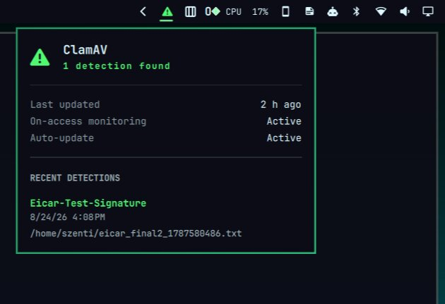

# ClamAV Monitor

An [Omarchy](https://omarchy.org/) bar widget that shows ClamAV's on-access
scan status: when the virus database last updated, whether on-access
monitoring and auto-update are running, and the most recent detections.

The bar icon switches to the theme's urgent color while a recent detection's
file is still present on disk, and stays that color until you open the panel
after every one of them is gone (quarantined or deleted) — a still-present
threat is never dismissed just by opening the panel. Click it to open:

- **Last updated** — age of the local virus database
- **On-access monitoring** / **Auto-update** — live status of `clamd`,
  `clamonacc`, and `freshclam`
- **Recent detections** — the last 10 hits, each with its signature name,
  timestamp (rendered in your OS's configured date/time format), and file
  path. Entries whose file no longer exists are kept for history and marked
  "Quarantined or removed"
- An **Open log** button appears once more than 10 detections are on
  record, opening the full log in your default editor



This plugin is **display only** — it reads ClamAV's own state and does not
install, configure, remove, or quarantine anything on your system. The
plugin binary itself never invokes `sudo`; every privileged command below
is a one-time, manual host setup step you run yourself before installing
the widget, not something the plugin executes on your behalf.

## Prerequisites

You need ClamAV's on-access scanner running and writing to its usual log,
plus a small companion service (included here) that adds a timestamp to
each detection, since `clamonacc`'s own log has none.

### 1. Install and run ClamAV

`sudo` is required here because ClamAV is a system package installed
outside your home directory, and `clamd`/`freshclam`/`clamonacc` are
system-wide services that need to run continuously (including before any
user logs in) — both are root-only operations on Arch.

```bash
sudo pacman -S --needed clamav
sudo freshclam                                                       # first signature download
sudo systemctl enable --now clamav-freshclam.service clamav-daemon.service
```

Append the on-access settings from [`setup/clamd-onaccess.conf`](setup/clamd-onaccess.conf)
to `/etc/clamav/clamd.conf`, adjusting the paths for your setup — in
particular, add an `OnAccessExcludePath` for any directory a background app
rewrites constantly (a sync client's own database, a browser cache, etc.).
Skipping this is the single most common cause of `clamonacc` pinning a CPU
core: every rewrite of an un-excluded file is picked up as a fresh scan
request.

```bash
sudo systemctl enable --now clamav-clamonacc.service
```

(This step also needs `sudo` — `clamav-clamonacc.service` is a system
service and only root can enable/start it.)

### 2. Let your user account read the log

`clamonacc`'s log is root-owned, and `setfacl` needs `sudo` to modify
permissions on a file it doesn't own. Grant read access with an ACL rather
than loosening the file's real permissions (e.g. `chmod`-ing it world- or
group-readable):

```bash
sudo setfacl -d -m u:"$(whoami)":r /var/log/clamav
sudo setfacl -m u:"$(whoami)":r /var/log/clamav/clamonacc.log
```

### 3. Install the detection-timestamp service

No `sudo` needed here — this is a `systemctl --user` service, scoped to
your account, reading a log you were just given ACL access to.

```bash
mkdir -p ~/.config/systemd/user
cp ~/.config/omarchy/plugins/io.github.szentesg.clamav-monitor/systemd/omarchy-clamav-detection-log.service \
   ~/.config/systemd/user/
systemctl --user daemon-reload
systemctl --user enable --now omarchy-clamav-detection-log.service
```

This tails `/var/log/clamav/clamonacc.log`, and for every detection line it
appends a timestamped copy to `~/.local/state/omarchy/clamav-detections.log`
— the file the widget actually reads.

## Install the widget

```bash
omarchy plugin clone io.github.szentesg.clamav-monitor    # or: omarchy plugin add <repo-url> --enable
omarchy plugin enable io.github.szentesg.clamav-monitor --section right
```

## Configure

The only setting is the background refresh interval (seconds):

```bash
omarchy bar set io.github.szentesg.clamav-monitor refreshIntervalSec 30 --json
```

## Remove

```bash
omarchy plugin disable io.github.szentesg.clamav-monitor
systemctl --user disable --now omarchy-clamav-detection-log.service
rm ~/.config/systemd/user/omarchy-clamav-detection-log.service
```

(This does not touch ClamAV itself — `clamd`/`clamonacc`/`freshclam` keep
running until you stop them separately.)

## License

MIT — see [LICENSE](LICENSE).
